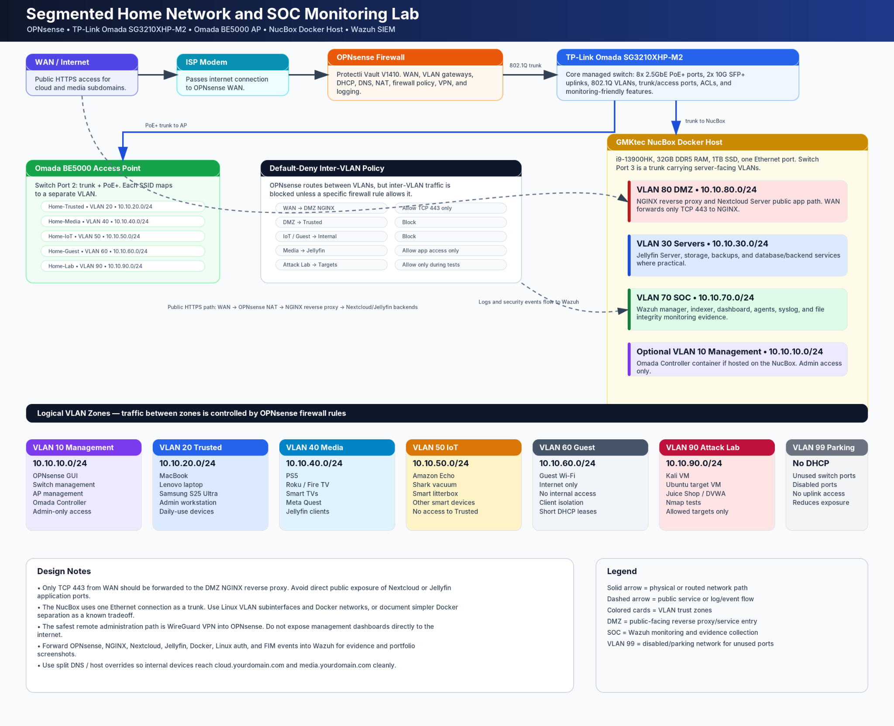

# Segmented Home Network and SOC Monitoring Lab


> **Current milestone:** Stage 3 — VLAN segmentation and new SSIDs complete, as confirmed by the project owner on September 23, 2026. All stage tests passed and configuration backups were created. The updated evidence package contains 31 sanitized screenshots supporting selected configuration, management-access, and firewall-block results; the four-VM deployment and service migration remain planned.

## Project summary



This project implements a segmented home network and plans public cybersecurity portfolio services, private home services, and a SOC monitoring lab. OPNsense routes and filters traffic between VLANs; the Omada switch and access point carry the wired and wireless zones. The NucBox is planned to use a VLAN-aware hypervisor and four persistent VMs.

| NucBox VM | Planned workloads | VLAN | Access |
|---|---|---:|---|
| **Public projects** | CISA KEV dashboard, personal portfolio, NGINX, Cloudflare Tunnel connector | **81** Public-project DMZ | Public sites through an outbound tunnel |
| **Nextcloud** | Nextcloud, database, cache, any local proxy needed for the app | **80** Nextcloud app zone | Approved Trusted/VPN clients |
| **Media/internal services** | Jellyfin and separately reviewed private services | **30** Servers | Approved Trusted/Media/VPN clients |
| **SOC** | Wazuh manager, indexer, dashboard, supporting components | **70** SOC | Restricted dashboard and log ingestion |

Docker Compose is planned **inside** the Linux VMs. The NucBox hypervisor's management address stays on VLAN 10. The Omada Controller is planned in a separate NucBox management container on VLAN 10; its resource allocation still needs hardware validation. Temporary Attack Lab systems are outside these four persistent NucBox VMs. The broader plan also includes NGINX, `cloudflared`, Nextcloud's database/cache, and Wazuh's supporting components in their respective VMs. AdGuard DNS, Uptime Kuma, CrowdSec/Fail2Ban-style controls, and additional sensing are later candidates that require separate placement and capacity decisions.

The planned NucBox has an Intel Core i9-13900HK, 32 GB DDR5 RAM, and a 1 TB SSD (owner-provided specifications). The exact NucBox SKU, usable storage, virtualization support, and workload capacity still need validation. The live KEV dashboard remains on its separately documented Ubuntu deployment until a tested migration is complete; this repository does not claim that the four-VM design is already running.

## Network and trust boundaries

| VLAN | Zone | Planned purpose |
|---:|---|---|
| 10 | Management | OPNsense, Omada switch/AP, NucBox hypervisor, Omada Controller |
| 20 | Trusted | Personal and approved admin devices |
| 30 | Servers | Jellyfin and other private services |
| 40 | Media | TVs, streaming devices, consoles |
| 50 | IoT | Smart-home devices |
| 60 | Guest | Internet-only visitors |
| 70 | SOC | Wazuh |
| 80 | Nextcloud app zone | Private Nextcloud VM |
| 81 | Public-project DMZ | KEV dashboard and portfolio VM |
| 90 | Attack Lab | Temporary controlled test systems |
| 99 | Parking | Unused switch ports; no routed subnet |

The one-NIC NucBox connects to an Omada switch trunk. A VLAN-aware virtual bridge gives each application VM its assigned VLAN, while **OPNsense** remains the router and default-deny firewall between zones. The public-projects VM must have no direct route or shared data mount into Nextcloud, Jellyfin, or Management. Traffic between containers in one VM or devices in one VLAN may not cross OPNsense, so guest and container controls still matter.

## Public and private access

```text
Public visitor → Cloudflare HTTPS → outbound tunnel
               → Public-projects VM, VLAN 81 → NGINX → KEV / portfolio

Approved local or VPN user → OPNsense → Nextcloud VM, VLAN 80
Approved local or VPN user → OPNsense → Jellyfin VM, VLAN 30
Approved admin or VPN user → Management (including Omada Controller) / SOC interfaces
```

The public-project connector needs only its own site origins and documented Cloudflare egress, including UDP/TCP 7844. The KEV and portfolio websites need no inbound WAN port forward or static public IP when published exclusively through that tunnel. Nextcloud and Jellyfin remain private; Wazuh, Docker, OPNsense, Omada, and hypervisor management receive no public hostname. Cloudflare Tunnel publication alone does not authenticate visitors.

Cloudflare's [public-route guidance](https://developers.cloudflare.com/tunnel/concepts/routing/) calls for a specific paid service to serve video and other large files. VPN access avoids designing Jellyfin streaming or private Nextcloud transfers around the ordinary public tunnel.

## Monitoring and recovery

Wazuh is planned to ingest OPNsense events, hypervisor and guest activity, NGINX and application logs, Docker events, and selected file-integrity changes. OPNsense sees the encrypted public tunnel connection, so public HTTP visibility depends on origin and application logs.

All four VMs share the NucBox's physical failure risk. Keep each VM's data, deployment files, and credentials separate; make application-consistent off-host backups and test restores. Measure CPU, RAM, disk, Wazuh retention, and Jellyfin transcoding before assigning resources or deciding whether a second host is needed. A later ThinkCentre could host the public-projects VM while retaining its VLAN 81 policy and public hostnames after a verified cutover.

## Implementation Status

**Updated:** September 23, 2026

**Current milestone:** Stage 3 — VLAN segmentation and new SSIDs complete

The project owner confirmed Stage 3 completion, successful completion of all stage tests, and creation of configuration backups on September 23. Parrot OS currently has access to the management infrastructure. The fresh cleanup captures show authenticated management pages at `10.10.10.1` (OPNsense), `10.10.10.2` (switch), and `10.10.10.3` (AP). The current Parrot client address is not shown.

During the earlier Step 9 validation, Parrot at `10.10.10.110` could not open the legacy switch and AP management pages. Correcting the firewall rule destination to `LEGACY_INFRA` and enabling the AP's Layer-3 Accessibility restored access. The owner confirmed approximately 10 minutes of troubleshooting with no household connectivity impact. Addresses in that incident describe the intermediate migration state, not an inventory of final management addresses.

The [management-access troubleshooting record](docs/06_Hardening_Backup_and_Operations/incidents/2026-09-23-mgmt-to-legacy-management-access.md) preserves the earlier failure and recovery. The [Stage 3 completion record](docs/00_Project_Overview/04_Stage_3_Completion_2026-09-23.md) records the owner-reported milestone, the new Parrot configuration evidence, and selected earlier process results. All screenshot assets in this review copy have been sanitized, including the nine historical incident images; actual wireless names are represented by functional roles. Later logs directly show blocked firewall-access attempts from Trusted, Media, and Guest. They do not individually demonstrate every inter-VLAN or guest peer-isolation test.

The owner subsequently reported legacy cleanup. The fresh captures confirm removal of both temporary legacy permits and the temporary MGMT firewall-HTTPS permit, show only `10.10.20.110` in the `ADMIN_HOSTS` edit form, and show Guest Network enabled on both Guest bands. The alias form does not establish save/persistence. The Lab entry now shows VLAN ID **Disable**, which does not establish that the WLAN is off; this needs clarification before Lab use. Switch membership/PVID details remain unchanged. Post-cleanup testing and refreshed backups were not separately confirmed. The [revised completion record](docs/00_Project_Overview/04_Stage_3_Completion_2026-09-23.md) distinguishes resolved observations from remaining follow-up.

Pre-VLAN internet performance was measured using [Measurement Lab](https://www.measurementlab.net/) on September 22, 2026:

| Connection | Download | Upload | Latency |
|---|---:|---:|---:|
| Wired | 898.45 Mbps | 39.51 Mbps | 14 ms |
| Wireless | 758.75 Mbps | 39.34 Mbps | 15 ms |

The wireless test used the 5 GHz band at approximately 5 feet from the AP.

The initial OPNsense configuration backup was successfully restored. Separate encrypted pre-VLAN backups were recorded on Parrot OS and an external 2 TB Seagate drive. New configuration backups were confirmed after Stage 3; their individual filenames, locations, and a separate restoration test were not supplied in this completion update. Earlier direct recovery access was tested through switch port 7 and Protectli physical port 3.

Versions recorded on September 22 were OPNsense `26.7.4-1`, switch firmware `3.0.29`, and AP firmware `1.2.4`. The supplied Omada captures use standalone management; Controller migration remains planned.

The September 23 completion set includes an internet speed result of **868 Mbps download and 35 Mbps upload**. Its client, VLAN, connection medium, and test conditions are not shown, so it is not a controlled comparison with the earlier wired or wireless baselines.

The next implementation stage is **Stage 4 — NucBox hypervisor and VMs**. Application hosting, Omada Controller adoption, and SOC monitoring are still planned. The build-phase document calls the hypervisor work Phase 3; the implementation-stage numbering includes earlier preparation and cutover as separate stages.

Architecture diagrams and configuration plans describe the intended design unless explicitly labeled as implemented and validated.

See the [September 22 progress report](docs/00_Project_Overview/03_Implementation_Progress_2026-09-22.md) for the historical pre-VLAN baseline and the [September 23 completion record](docs/00_Project_Overview/04_Stage_3_Completion_2026-09-23.md) for the current milestone.

## Status and validation roadmap

### Documented target design

- [x] Four VM roles and separate public-project VLAN 81
- [x] Private access plan for Nextcloud and Jellyfin
- [x] Outbound tunnel plan for KEV and portfolio
- [x] Revised network, firewall, service, SOC, and recovery plans

### Still to implement and verify

- [ ] Record the exact NucBox SKU; verify the i9-13900HK, 32 GB DDR5 RAM, 1 TB SSD, virtualization support, usable storage, and capacity for four VMs plus the Omada management container
- [ ] Adopt switch/AP into the Omada Controller during a separate change and repeat trunk, SSID, DHCP, management, and isolation tests
- [ ] Install hypervisor with management on VLAN 10 and VLAN-aware bridge
- [ ] Create and harden the four VMs in stages
- [ ] Deploy and test Nextcloud, Jellyfin, Wazuh, and portfolio workloads
- [ ] Stage and validate KEV migration without interrupting its current live deployment
- [ ] Verify public HTTPS, private VPN paths, denied cross-zone access, logs, and backups
- [ ] Run authorized Attack Lab tests and capture sanitized evidence
- [ ] Test off-host recovery and document measured limits

## Documentation

### Project overview

- [Project Summary](docs/00_Project_Overview/01_Project_Summary.md)
- [Build Phases](docs/00_Project_Overview/02_Build_Phases.md)
- [Implementation Progress — September 22, 2026](docs/00_Project_Overview/03_Implementation_Progress_2026-09-22.md)
- [Stage 3 Completion — September 23, 2026](docs/00_Project_Overview/04_Stage_3_Completion_2026-09-23.md)

### Network design

- [Planned Logical Topology](docs/01_Network_Design/01_Final_Logical_Topology.md)
- [VLAN and Subnet Plan](docs/01_Network_Design/02_VLAN_and_Subnet_Plan.md)
- [Firewall Rule Matrix](docs/01_Network_Design/03_Firewall_Rule_Matrix.md)

### OPNsense and Omada

- [OPNsense Interface and VLAN Plan](docs/02_OPNsense_and_Omada_Config/01_OPNsense_Interface_and_VLAN_Plan.md)
- [Omada Switch and Access Point Plan](docs/02_OPNsense_and_Omada_Config/02_TP_Link_Omada_Switch_and_AP_Plan.md)
- [Omada Controller Plan](docs/02_OPNsense_and_Omada_Config/03_Omada_Controller_Plan.md)

### NucBox VMs and services

- [NucBox Four-VM Host Plan](docs/03_Docker_and_Public_Services/01_NucBox_Docker_Host_Plan.md)
- [Public Projects and Cloudflare Tunnel](docs/03_Docker_and_Public_Services/02_NGINX_Reverse_Proxy_and_Public_Services.md)
- [Nextcloud Server Plan](docs/03_Docker_and_Public_Services/03_Nextcloud_Server_Plan.md)
- [Jellyfin Server Plan](docs/03_Docker_and_Public_Services/04_Jellyfin_Server_Plan.md)

### SOC, testing, and operations

- [Wazuh SOC Monitoring Plan](docs/04_SOC_and_Monitoring/01_Wazuh_SOC_Monitoring_Plan.md)
- [Attack Lab Plan](docs/05_Attack_Lab_and_Detections/01_Attack_Lab_Plan.md)
- [Hardening, Backup, and Operations](docs/06_Hardening_Backup_and_Operations/01_Hardening_Backup_and_Operations.md)
- [Management VLAN Access Troubleshooting — September 23, 2026](docs/06_Hardening_Backup_and_Operations/incidents/2026-09-23-mgmt-to-legacy-management-access.md)
- [Planning Milestone](docs/07_Portfolio_Deliverables/01_Portfolio_Case_Study_Planning_Milestone.md)
- [Lessons Learned](docs/07_Portfolio_Deliverables/02_Lessons_Learned.md)
- [Sources and Documentation Links](docs/08_References/Sources_and_Documentation_Links.md)

## Responsible use

Testing is limited to systems and networks owned by the operator or explicitly authorized for testing. Intentionally vulnerable targets remain isolated. Planned controls are not treated as verified until implementation evidence is captured.
