# Stage 3 Completion: VLAN Segmentation and New SSIDs

**Completion date:** September 23, 2026  
**Status:** Initial Stage 3 completion, passing tests, and configuration backups were reported by the project owner. Later cleanup is reviewed below; post-cleanup tests and refreshed backups were not separately reported.  
**Documentation revision:** Revision 2 — cleanup captures from 23:43–23:46 on September 23 reviewed and sanitized. The earlier evidence is retained as history.  
**Scope:** Documentation review only. No live configuration changes or independent network retest.

## Summary

Stage 3 is complete according to the owner's earlier confirmation that all stage tests passed and configuration backups were created. The owner subsequently reported cleanup of legacy configurations and supplied eight fresh Parrot screenshots. This revision documents those changes without treating the earlier test and backup results as a new post-cleanup validation.

The new screenshots show the two temporary legacy-management permits and the temporary MGMT-to-firewall HTTPS permit removed from the visible MGMT interface rules. The `ADMIN_HOSTS` form now contains only `10.10.20.110`. The TRUSTED policy remains in place, and the AP status page now shows Guest Network enabled for both Guest entries. Management pages remain captured at `10.10.10.1` (OPNsense), `.2` (switch), and `.3` (AP).

**Open review item:** The Lab entry now shows **VLAN ID: Disable**, replacing its earlier VLAN 90 mapping. This is a VLAN-tagging setting; the screenshot does not show the WLAN switched off. Its intended availability and network placement need clarification. The switch membership and PVID settings are unchanged in the fresh captures.

## Cleanup changes

| Item | Earlier capture | Fresh capture | Documentation result |
|---|---|---|---|
| Temporary legacy permits on MGMT | Two overlapping permits to `LEGACY_INFRA` | Both absent from C02 | Visible rule cleanup confirmed |
| Temporary firewall HTTPS permit on MGMT | `ADMIN_HOSTS` → This Firewall HTTPS | Absent from C02 | Visible rule cleanup confirmed; TRUSTED admin permits remain in C01 |
| `ADMIN_HOSTS` | `10.10.10.110` and `10.10.20.110` | Only `10.10.20.110` in C03 | Narrowed alias values shown; edit form does not establish persistence |
| Guest Network feature | Disabled on both Guest bands | Enabled on both in C08 | Configuration observation closed; runtime peer isolation still has no separate capture |
| Lab wireless VLAN | VLAN 90 in P09/P10; broadcast disabled in P09 | VLAN ID displays Disable in C08; zero clients | New discrepancy to resolve; WLAN off status is not established |
| TRUSTED rules / `MGMT_INFRA` | Seven rules / three infrastructure addresses | Same values in C01/C04 | No visible change |
| Switch membership / PVIDs | 13 VLAN records / ten port settings | Same values in C05–C07 | Earlier port-behavior questions remain |

The images establish these specific changes. A complete audit proving that all legacy aliases, interfaces, addresses, and services were removed was not supplied.

## Validation and evidence

| Area | Recorded result | Evidence and practical limit |
|---|---|---|
| Initial Stage 3 tests | All passed | Earlier owner confirmation; individual output not supplied for every test |
| Legacy cleanup | Owner-reported cleanup; visible temporary-rule removal confirmed | C02 directly shows removal of the three temporary MGMT permits; C03 shows the narrowed admin alias |
| Parrot administration after cleanup | Management pages displayed | C01–C08 show authenticated device pages; capture-time Parrot IP/interface and separate connection tests are not shown |
| Management addresses | Firewall `.1`, switch `.2`, AP `.3` on `10.10.10.0/24` | Browser URLs; C04 also lists all three in `MGMT_INFRA` |
| TRUSTED policy | Intended block actions and admin exceptions retained | C01; same visible rules as P01 |
| MGMT policy | Four baseline rules remain | C02; DNS permit, firewall block, internal-network block, and internet permit |
| Switch | 13 VLAN records and ten port PVIDs | C05–C07; membership does not establish egress tagging |
| Wireless clients | One client each on Trusted 2.4 GHz, IoT, and Media | C08 association counts; counts alone do not establish internet or isolation tests |
| Guest feature | Enabled on both Guest entries | C08; zero associated Guest clients at capture time |
| Unauthorized firewall access | Earlier selected requests blocked | S12–S14 are prior runtime evidence, not post-cleanup retests |
| Post-cleanup full validation / peer isolation | Not separately supplied | Earlier all-tests confirmation is preserved; no fresh test matrix or packet/log evidence |
| Internet performance | Earlier 868 Mbps down / 35 Mbps up result | S15; connection medium and conditions unspecified |
| Initial Stage 3 backups | Created | Earlier owner confirmation |
| Backups after this cleanup / restore | Not separately reported | Do not assume the earlier backup contains the later changes |

Final OPNsense rule views and endpoint runtime captures were not supplied for VLANs 30, 70, 80, 81, or 90. Their switch configuration is documented; these images do not independently establish isolation for those zones.

Screenshots of edit forms and Save controls establish displayed values, not a save operation or reboot persistence. C03's single `ADMIN_HOSTS` entry does not independently establish Parrot's current source address. This review did not connect to or retest the network.

## Management and firewall configuration

### Current management inventory

| Component | Captured management address | Evidence |
|---|---|---|
| OPNsense | `10.10.10.1` | C01–C04 browser address |
| Omada switch | `10.10.10.2` | C05–C07 browser address and switch interface |
| Omada AP | `10.10.10.3` | C08 browser address and AP status interface |
| Displayed approved administration host | `10.10.20.110` only | C03 enabled `ADMIN_HOSTS` form; earlier MGMT entry absent from the form; save/persistence unverified |
| Approved infrastructure destinations | `10.10.10.1`, `.2`, `.3` | C04 enabled `MGMT_INFRA` form; unchanged |

### TRUSTED policy shown in C01

The seven visible enabled IPv4 interface rules appear in this order:

| Order | Action / protocol | Source | Destination | Service |
|---:|---|---|---|---|
| 1 | Pass TCP/UDP | TRUSTED network | This Firewall | DNS / 53 |
| 2 | Pass TCP | `ADMIN_HOSTS` | This Firewall | HTTPS / 443 |
| 3 | Pass TCP/UDP | `ADMIN_HOSTS` | `MGMT_INFRA` | `ADMIN_PORTS` |
| 4 | Pass ICMP | `ADMIN_HOSTS` | `MGMT_INFRA` | ICMP |
| 5 | Block any | TRUSTED network | This Firewall | Any |
| 6 | Block any | TRUSTED network | `LOCAL_V4_NETS` | Any |
| 7 | Pass any | TRUSTED network | Any | Any |

The earlier 01.52.18 process image showed pass icons beside two block descriptions. P01 showed their correction, and C01 retains both block actions after cleanup. S12 records earlier denied non-admin firewall HTTPS attempts. The explicit admin exceptions are consistent with the documented administration path from Trusted.

`ADMIN_PORTS` was shown as 22 and 443 in the earlier incident evidence E08; its contents were not reopened in the new set. C01 still uses TCP/UDP for this alias, so the captured scope is broader than TCP-only SSH/HTTPS. No SSH or UDP service test is claimed.

### MGMT policy after cleanup

C02 shows only these four enabled IPv4 interface rules, in order:

| Order | Action / protocol | Source | Destination | Service |
|---:|---|---|---|---|
| 1 | Pass TCP/UDP | MGMT network | This Firewall | DNS / 53 |
| 2 | Block any | MGMT network | This Firewall | Any |
| 3 | Block any | MGMT network | `LOCAL_V4_NETS` | Any |
| 4 | Pass any | MGMT network | Any | Any |

Both prior `ADMIN_HOSTS` → `LEGACY_INFRA` permits are absent, as is the temporary `ADMIN_HOSTS` → This Firewall HTTPS permit. The visible cleanup removes all three temporary permits previously shown in P02. The authorized administration exceptions remain on TRUSTED in C01, with C03 showing the Trusted host address alone.

The [Step 9 management-access incident](../06_Hardening_Backup_and_Operations/incidents/2026-09-23-mgmt-to-legacy-management-access.md) remains a historical record of access to legacy `10.255.250.x` addresses. P02 is retained as before-cleanup evidence. The new C02 rule list supersedes it for current MGMT policy. No claim is made that the `LEGACY_INFRA` alias or every legacy interface/address was deleted, because their full configuration is not visible.

## Switch configuration captured after Stage 3

Port numbers below abbreviate the switch's `1/0/N` notation. C05 and C06 are overlapping views of the same 13-record table. Membership is unchanged from P05/P06.

| VLAN | Role / displayed label | Member ports |
|---:|---|---|
| 1 | System-VLAN | None displayed |
| 10 | MGMT | 1, 2, 3, 7 |
| 20 | TRUSTED | 1, 2, 7 |
| 30 | SERVERS | 1, 3 |
| 40 | MEDIA | 1, 2, 4 |
| 50 | IoT | 1, 2 |
| 60 | GUEST | 1, 2 |
| 70 | SOC | 1, 3 |
| 80 | NEXTCLOUD | 1, 3 |
| 81 | Public projects; displayed label has a spelling error | 1, 3 |
| 90 | ATTACK | 1, 2 |
| 99 | PARKING | 5, 6, 8, 9, 10 |
| 999 | OPNsense | 1 |

| Port | Captured PVID | Relation to design |
|---|---:|---|
| 1 | 999 | Planned firewall uplink; VLAN 999 is additionally present in the observed configuration |
| 2 | 10 | Planned AP connection |
| 3 | 99 | Planned NucBox connection; VLAN 99 membership is not displayed for this port |
| 4 | 40 | Media assignment |
| 5–6 | 99 | Parked in current capture; earlier plan proposed future Media uses |
| 7 | 20 | Trusted PVID; also listed as a VLAN 10 member |
| 8–10 | 99 | Parked in current capture; future uses remain planned |

C07 shows unchanged PVIDs, ingress checking enabled and Acceptable Frame Types set to **Admit All** on all ten ports; no LAG is shown. The captures do not show individual tagged/untagged egress settings, operational link status, or physical cabling. VLAN 999's routed status, subnet, and exact purpose are not established by its label or PVID.

## Wireless configuration after cleanup

C08 is an AP **Status → Wireless** page, rather than the earlier configuration form. Functional role labels replace the actual wireless names in publication copies.

| Role | Band | Current VLAN ID display | Guest Network | Associated clients |
|---|---|---|---|---:|
| Trusted | 2.4 GHz | 20 | Disable | 1 |
| IoT | 2.4 GHz | 50 | Disable | 1 |
| Guest | 2.4 GHz | 60 | Enable | 0 |
| Trusted | 5 GHz | 20 | Disable | 0 |
| Media | 5 GHz | 40 | Disable | 1 |
| Guest | 5 GHz | 60 | Enable | 0 |
| Lab | 5 GHz | **Disable** | Disable | 0 |

All seven entries show WPA-Personal and Portal disabled. The status page shows the 2.4 GHz radio enabled on channel 6 / 2437 MHz with a 20 MHz channel width. It does not show the current SSID Broadcast controls or the 5 GHz radio-enable setting. P08/P09 retain the earlier radio/broadcast settings as historical evidence only. No old household, test, or Management SSID appears in C08.

### Guest feature enabled

C08 closes the prior observation that the AP Guest Network feature was disabled: it is now **Enable** for both VLAN 60 entries. It shows zero Guest clients at that instant. A same-VLAN or cross-band peer-isolation test is still a distinct validation result; no new test output was supplied. The earlier gateway-denial logs remain useful historical firewall evidence.

### Lab VLAN tagging requires clarification

C08 replaces the earlier Lab VLAN 90 value with **Disable in the VLAN ID column**. That label does not establish that the SSID has been disabled or removed. Its zero-client count is also not proof of that. TP-Link separates wireless VLAN tagging from SSID Broadcast, and describes untagged client traffic when no wireless VLAN tag is assigned. See the [TP-Link standalone EAP configuration guide](https://www.tp-link.com/us/configuration-guides/configuring_eap_standalone_eap/).

**Conditional risk, not a tested outcome:** Port 2 is the planned AP connection and still has PVID 10 in C07. If the Lab SSID remains connectable and its frames reach that port untagged, they may be assigned to Management VLAN 10. TP-Link describes this PVID handling in its [switch management guide, Port Settings](https://static.tp-link.com/upload/manual/2026/202602/20260228/1900002158_Manage%20Switches%20via%20the%20Omada%20Controller_6.1.0.pdf#page=30). The physical cable, complete tagging configuration, Lab association, addressing, and reachability were not tested in this review.

The documentation therefore keeps Lab availability and placement **unresolved**. If the intended state is off, use an actual WLAN disable control or remove the Lab entry and document the result. If it should be usable, retain the planned VLAN 90 mapping and validate its isolation. No live change has been made during this review.

## Cleanup review and remaining follow-up

| Item | Current status | Remaining record/action |
|---|---|---|
| Temporary MGMT permits | **Resolved in visible rule list** | C02 shows both legacy permits and the temporary firewall HTTPS permit removed |
| Transitional admin address | **Removed from displayed alias** | C03 contains only `10.10.20.110`; save/persistence is not independently shown |
| Guest Network setting | **Enabled on both bands** | Record the post-cleanup Guest-client test; feature state alone is not a peer-isolation result |
| Lab placement / availability | **Needs clarification** | Current VLAN tagging is disabled; establish an off state or restore intended VLAN 90 before using the Lab |
| Post-cleanup validation and backups | **Not separately reported** | Record management/segmentation checks after the changes and refresh configuration backups |
| NucBox port 3 | **Unchanged** | PVID 99 but absent from displayed VLAN 99 membership; verify intended tagged/untagged handling before hypervisor use |
| Admin port 7 | **Unchanged** | Member of VLANs 10 and 20 with PVID 20; document egress tagging and intended VLAN 10 access |
| Firewall uplink / VLAN 999 | **Unchanged** | Explain its relationship to the firewall's parent/untagged interface; routed status is not shown |
| TRUSTED admin service protocol | **TCP/UDP retained** | Confirm whether UDP is required for `ADMIN_PORTS`; earlier contents were 22 and 443 |
| VLAN 81 display name | **Cosmetic typo remains** | Optional label correction; VLAN ID stays 81 |

This table closes the observations supported by the cleanup evidence and retains only the remaining configuration or validation questions. The owner’s earlier Stage 3 completion statement remains recorded.

## Backups and performance

The owner confirmed configuration backups after initial Stage 3 completion. No separate confirmation of refreshed backups after this cleanup was supplied. The earlier Stage 1 external-drive backup and full restore were also confirmed. A restore of the new Stage 3 exports, their exact filenames, and their storage/encryption details were not separately supplied. Raw backups are excluded from the documentation package.

The retained speed result is **868 Mbps download / 35 Mbps upload**. Its public WAN address and server location are redacted. The result is not labeled wired or wireless because those conditions are not visible. WAN remains DHCP according to the owner; a long-lived lease does not make the assignment static.

## Evidence inventory and chronology

**C01–C08 are the current cleanup captures.** P01–P10 are the earlier 23:01–23:07 Parrot set and are retained for comparison. S12–S15 are earlier runtime/performance evidence; E01–E09 belong to the historical management-access incident. There are **31 sanitized screenshot derivatives** in this revision: 8 cleanup, 14 earlier Stage 3, and 9 incident images.

| ID | Fresh original filename | Evidence |
|---|---|---|
| C01 | `Screenshot_20260923_234302.png` | TRUSTED policy retained |
| C02 | `Screenshot_20260923_234335.png` | MGMT reduced to four rules; temporary permits absent |
| C03 | `Screenshot_20260923_234400.png` | `ADMIN_HOSTS` narrowed to the Trusted address |
| C04 | `Screenshot_20260923_234420.png` | `MGMT_INFRA` unchanged |
| C05 | `Screenshot_20260923_234511.png` | Switch VLAN membership, upper view |
| C06 | `Screenshot_20260923_234523.png` | Switch VLAN membership, lower view |
| C07 | `Screenshot_20260923_234534.png` | Switch PVIDs unchanged |
| C08 | `Screenshot_20260923_234633.png` | AP status: Guest enabled, Lab VLAN ID Disable, client counts |

The earlier filenames, hashes, and evidence IDs are retained in the [redaction manifest](../../assets/screenshots/REDACTION_MANIFEST.json). Their galleries below are explicitly historical. Earlier process views excluded from the first package remain excluded; no raw configuration exports are included.

## Redaction and evidence integrity

The previously authorized solid-mask method is retained. All eight fresh images have personal browser/desktop context removed; OPNsense captures also mask the administrator account/internal hostname, and the AP capture masks actual wireless names. Private technical IPs, VLAN IDs, aliases, models, counters, and rule decisions remain visible. Earlier public WAN-address and SSID redactions are retained.

All **31** derivatives have embedded metadata removed. **25** contain visible masks; **6** earlier cropped images required metadata removal only. For the eight fresh captures, automated comparison verifies original dimensions, opaque masks, and identical RGBA pixels outside the masks. The 23 earlier derivatives were checked against their previously verified output hashes; their source-pixel verification is carried forward from Revision 1. This review does not modify source images or establish live network behavior from image integrity checks.

The manifest records original filenames, source/output SHA-256 hashes, and mask coordinates. This is a local documentation revision for owner review. No changes were committed or pushed, and no network settings were changed.

## Next implementation stage

**Stage 4 — NucBox hypervisor and VMs** remains next. Start with hardware/storage inventory, resolve the Lab placement/availability question, and confirm Port 3 tagging behavior before the hypervisor connection. Record post-cleanup tests and refreshed configuration backups. The [build-phase plan](02_Build_Phases.md) calls this Phase 3 because it uses a different numbering scheme.

The four application VMs, Omada Controller adoption, application deployment, public-project migration, and SOC monitoring remain planned until separately implemented and validated.

## Current cleanup screenshot gallery

The following eight images are the newest evidence; their original filenames are in the inventory above.

### C01 — TRUSTED policy after cleanup

Seven visible rules retain the authorized administration exceptions and block actions.

### C02 — MGMT policy after cleanup

Four baseline rules remain. All three temporary permits from P02 are absent.

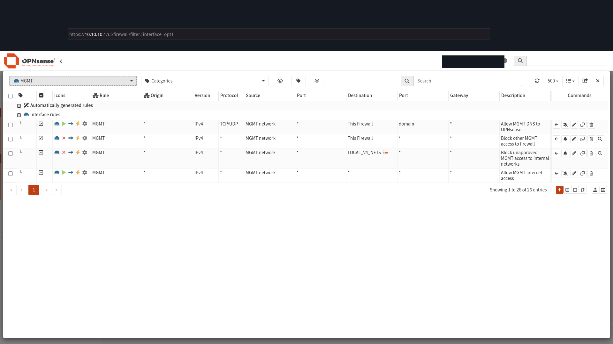

### C03 — Administration host alias

Only the Trusted administration address remains in the displayed alias form.

### C04 — Infrastructure alias

The three Management infrastructure addresses are unchanged.

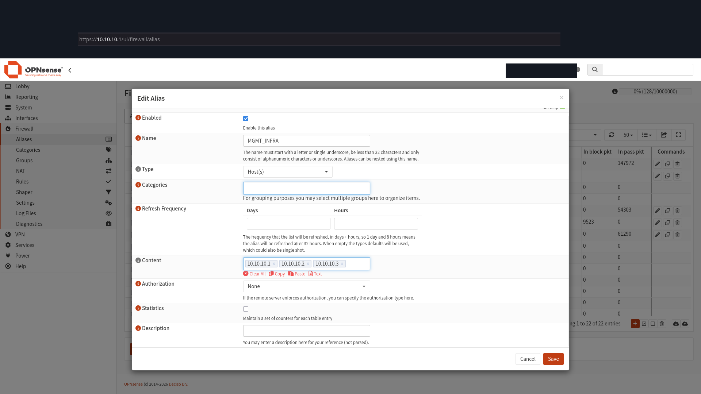

### C05 — Switch VLANs, upper view

Membership is unchanged from the prior capture.

### C06 — Switch VLANs, lower view

VLANs 90, 99, and 999 remain as previously displayed.

### C07 — Switch port PVIDs

All ten PVIDs remain unchanged; egress tagging is outside this view.

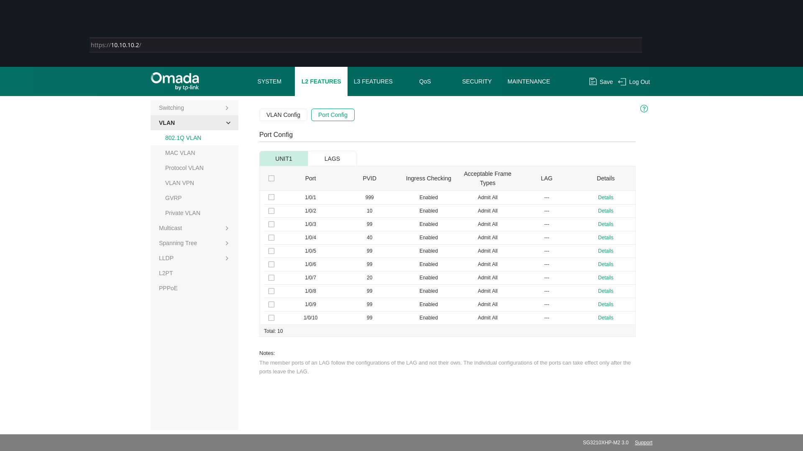

### C08 — AP wireless status after cleanup

Guest Network is enabled for both Guest entries. The Lab entry has VLAN ID Disable and zero clients; this does not demonstrate that the WLAN is off.

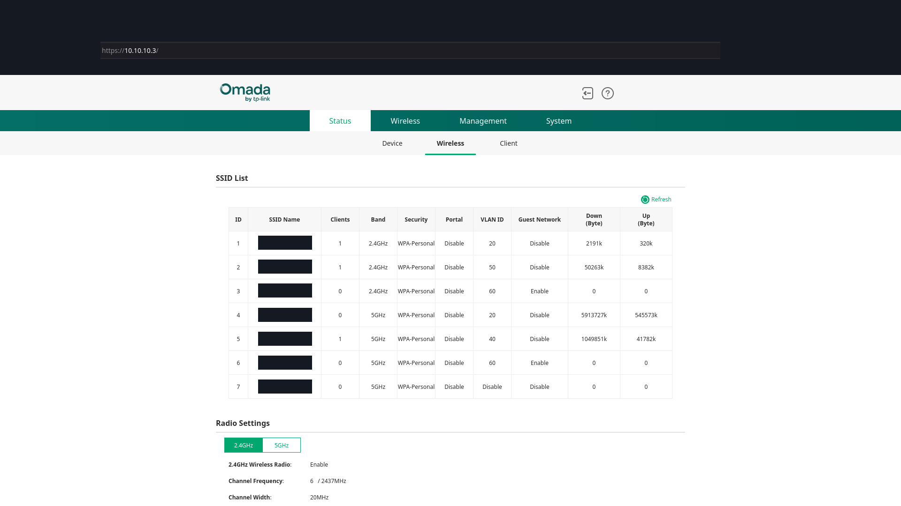

## Earlier evidence gallery — before cleanup

P01–P10 below show the earlier 23:01–23:07 state and are retained for change history. C01–C08 above supersede them where the displayed settings changed. S12–S15 remain earlier runtime/performance evidence. Masked wireless names are described by functional role.

### P01 — TRUSTED rule actions

Two intended deny rules now display block actions; explicit admin exceptions precede them.

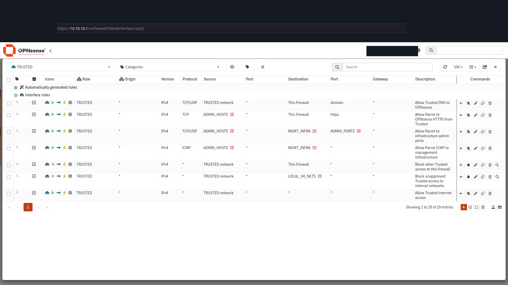

### P02 — MGMT rule order

Before cleanup, temporary legacy-access rules were present above and below the baseline policy. C02 now shows them removed.

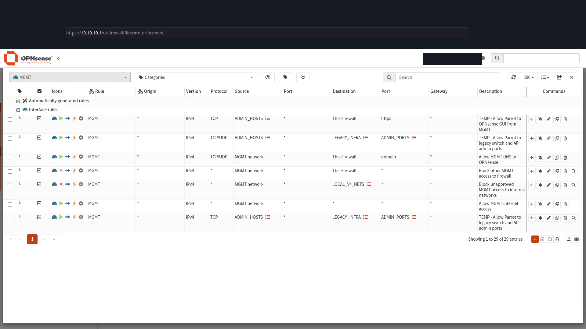

### P03 — Approved administration hosts

Before cleanup, two approved host addresses appeared in the alias form. C03 now shows only the Trusted address.

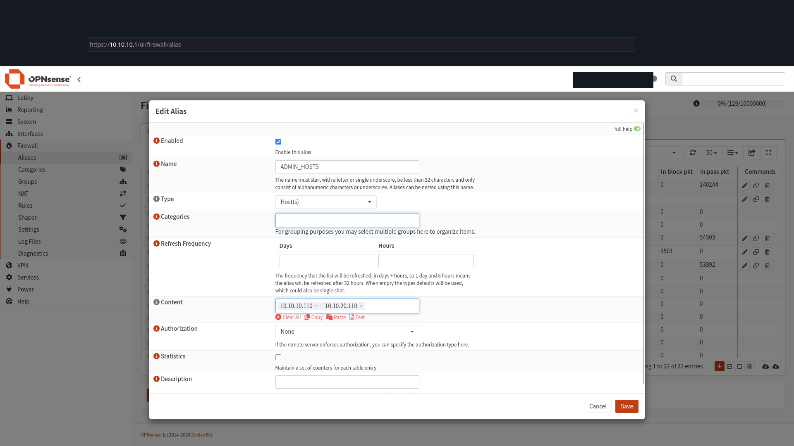

### P04 — Management infrastructure alias

Firewall, switch, and AP destination addresses appear in the alias form.

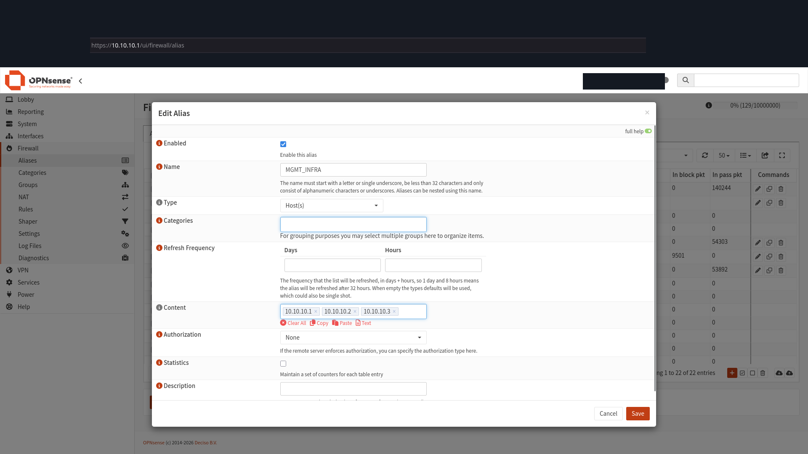

### P05 — Switch VLAN list, upper view

First part of the 13-record membership table at the switch Management address.

### P06 — Switch VLAN list, lower view

Remaining VLANs include Attack 90, Parking 99, and the OPNsense-labeled VLAN 999.

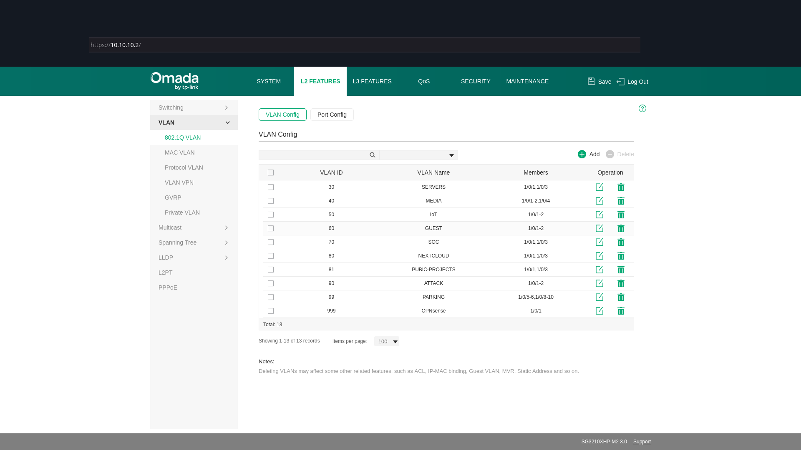

### P07 — Switch port PVIDs

All ten PVIDs, enabled ingress checking, and Admit All frame settings are visible.

### P08 — 2.4 GHz wireless entries

Earlier rows are Trusted, IoT, and Guest; Guest Network was disabled. C08 now shows the Guest feature enabled.

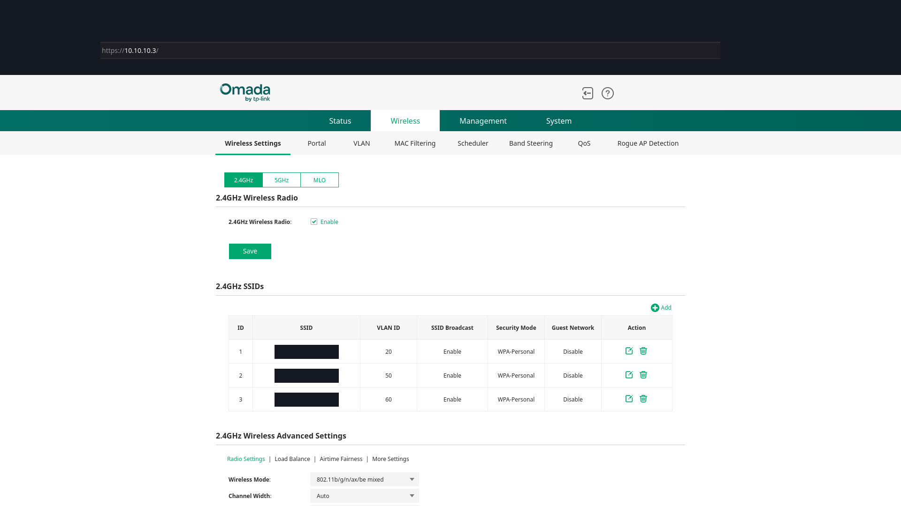

### P09 — 5 GHz wireless entries

Earlier rows are Trusted, Media, Guest, and Lab. Lab had VLAN 90 and SSID Broadcast disabled. C08 now shows its VLAN ID as Disable; current broadcast controls are not shown.

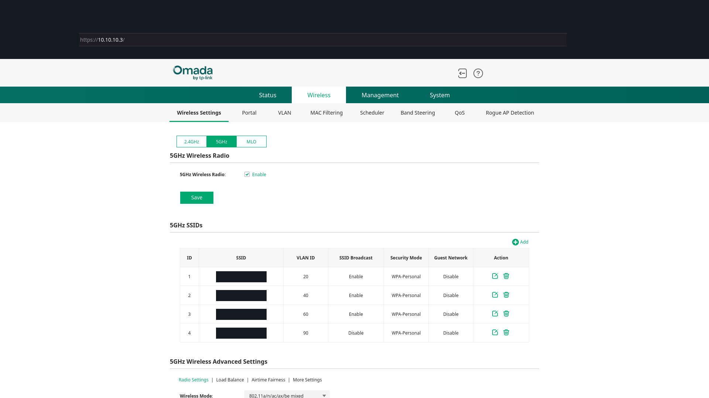

### P10 — Wireless VLAN mappings

Earlier mappings were Trusted 20, IoT 50, Guest 60, Trusted 20, Media 40, Guest 60, and Lab 90. C08 supersedes the Lab mapping with the displayed VLAN ID Disable.

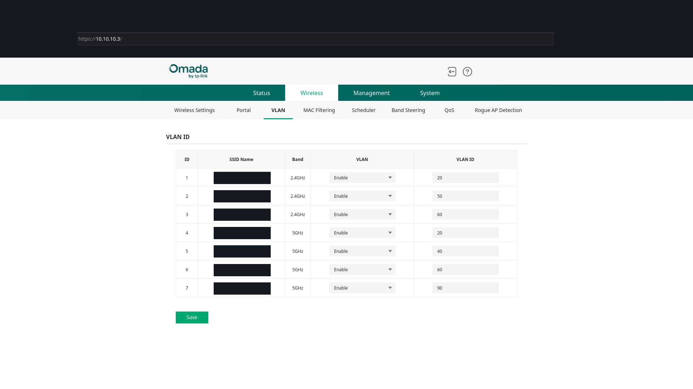

### S12 — Trusted denial evidence

Captured TCP 443 requests to the Management gateway are blocked.

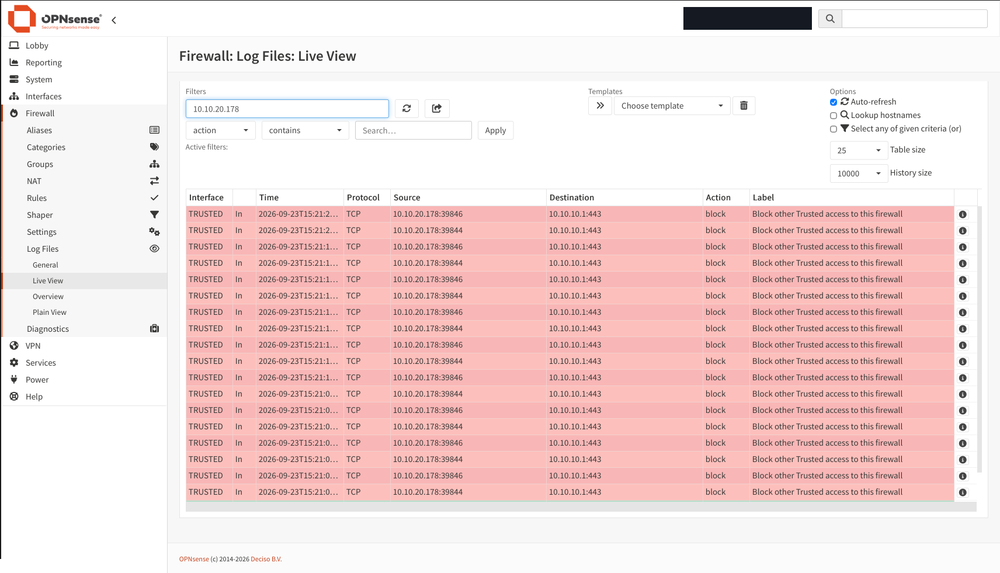

### S13 — Media denial evidence

Captured TCP 443/80 requests to the Trusted gateway are blocked; the destination is a firewall address.

### S14 — Guest denial evidence

Captured ICMP and selected TCP requests to firewall gateway addresses are blocked; no peer-isolation conclusion follows from this image alone.

### S15 — Internet speed result

868 Mbps download and 35 Mbps upload; connection medium and client are unspecified.

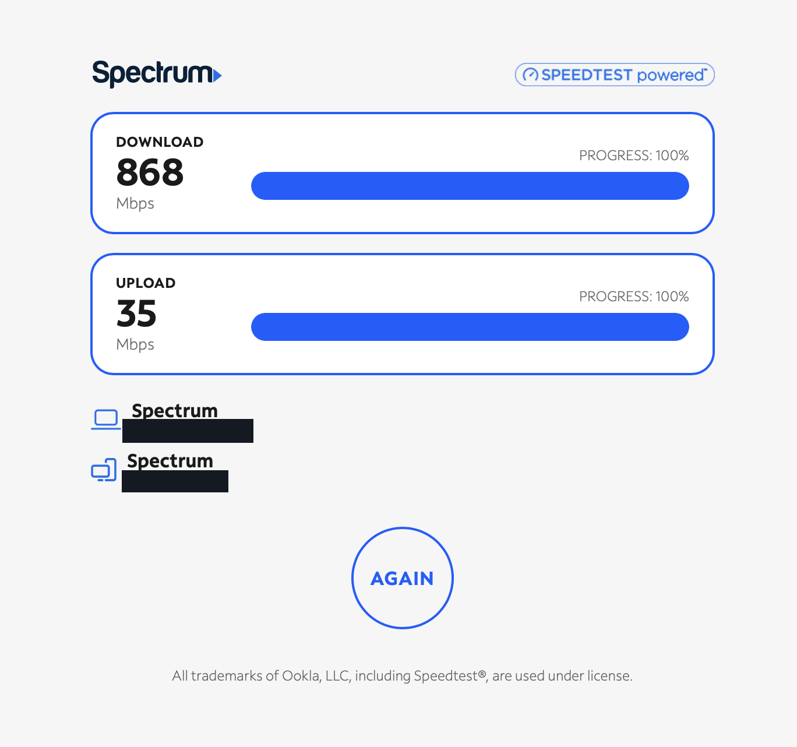
