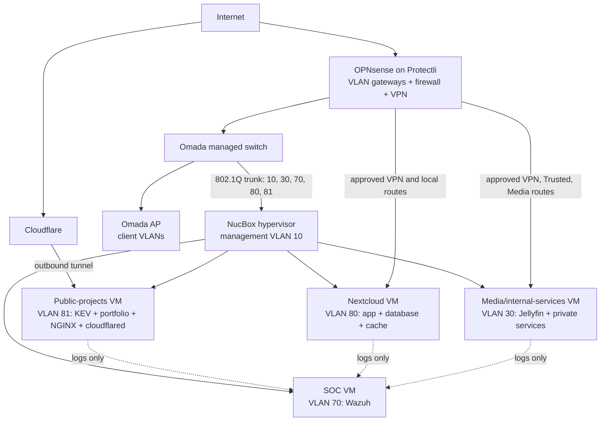

# Planned Logical Topology

The four-VM arrangement below supersedes the original single-Docker-host design. It is a proposed architecture pending installation and validation.

OPNsense routes between VLANs and enforces default-deny policy. The NucBox bridge assigns VLAN tags to VMs but must not act as an inter-VLAN router. Two devices inside one VLAN, or two containers inside one VM, can exchange traffic without crossing OPNsense; the public VM and Nextcloud therefore use different VLANs.

| Flow | Planned path |
|---|---|
| Public KEV/portfolio | Visitor → Cloudflare HTTPS → public-project tunnel → NGINX/origin in VLAN 81 |
| Private Nextcloud | Approved Trusted/VPN client → OPNsense → VLAN 80 |
| Private Jellyfin | Approved Trusted/Media/VPN client → OPNsense → VLAN 30 |
| Administration | Approved admin/VPN source → Management VLAN 10 or restricted SOC/application admin endpoint |
| Monitoring | Approved source → Wazuh ingestion on VLAN 70 |
| Attack testing | Isolated VLAN 90 → explicitly approved lab target only |

No direct WAN forwarding is planned for KEV, portfolio, Nextcloud, Jellyfin, Wazuh, or infrastructure administration. A VPN endpoint on OPNsense may require its own tightly scoped access configuration. The NucBox is still one physical failure domain; off-host backups and restore tests are part of the design.
