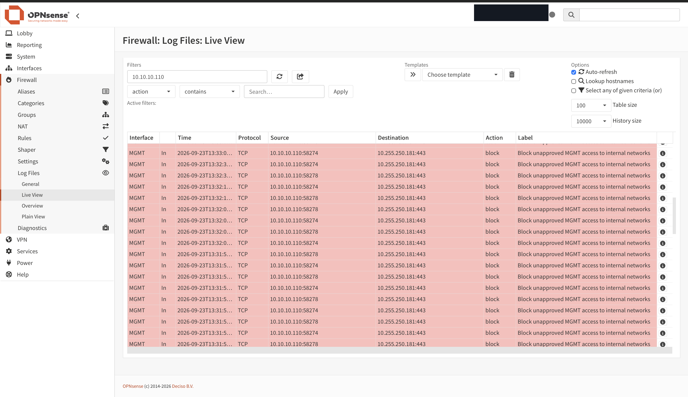
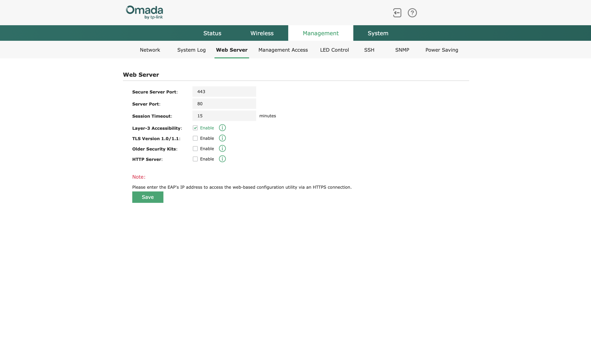
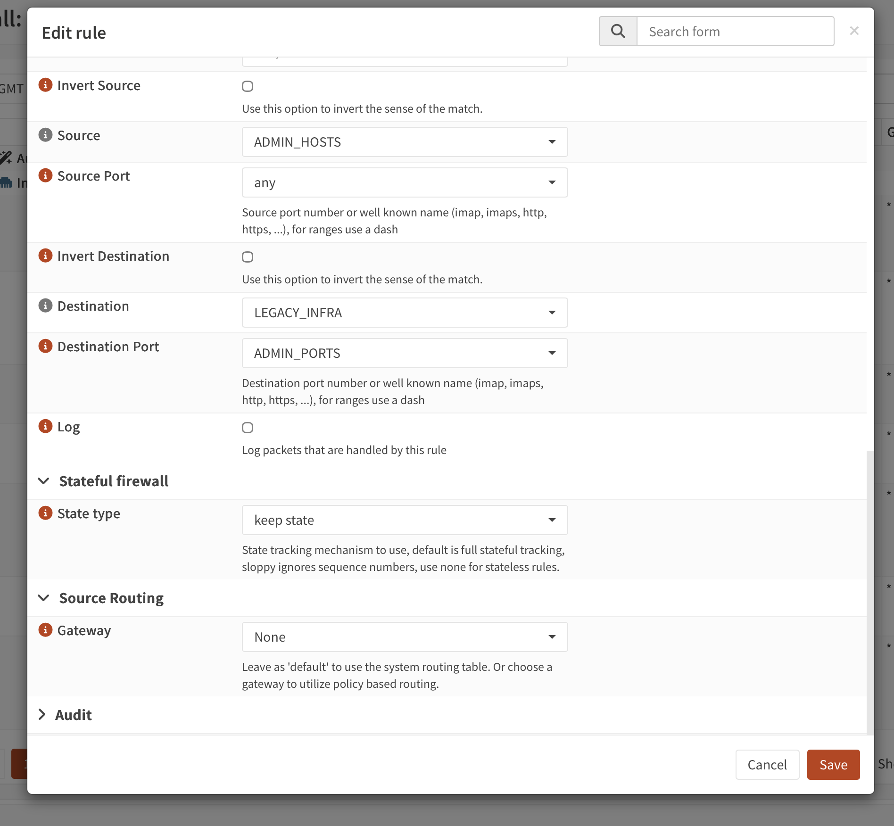
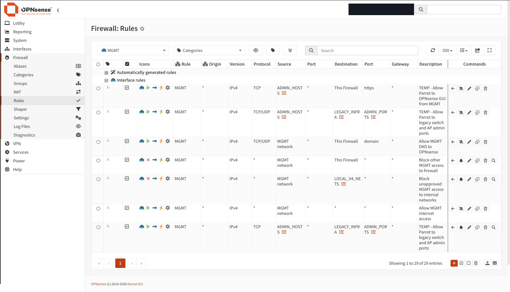
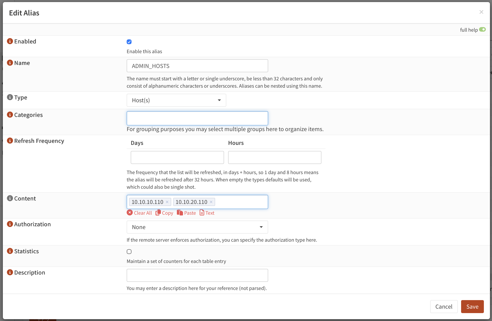
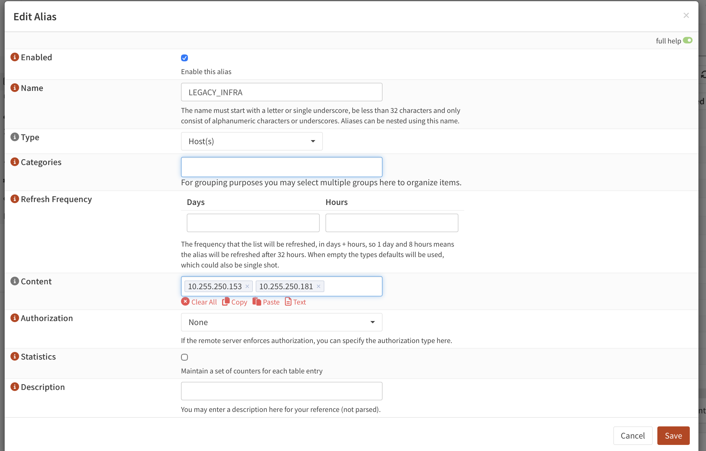
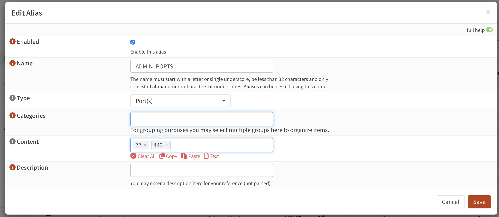
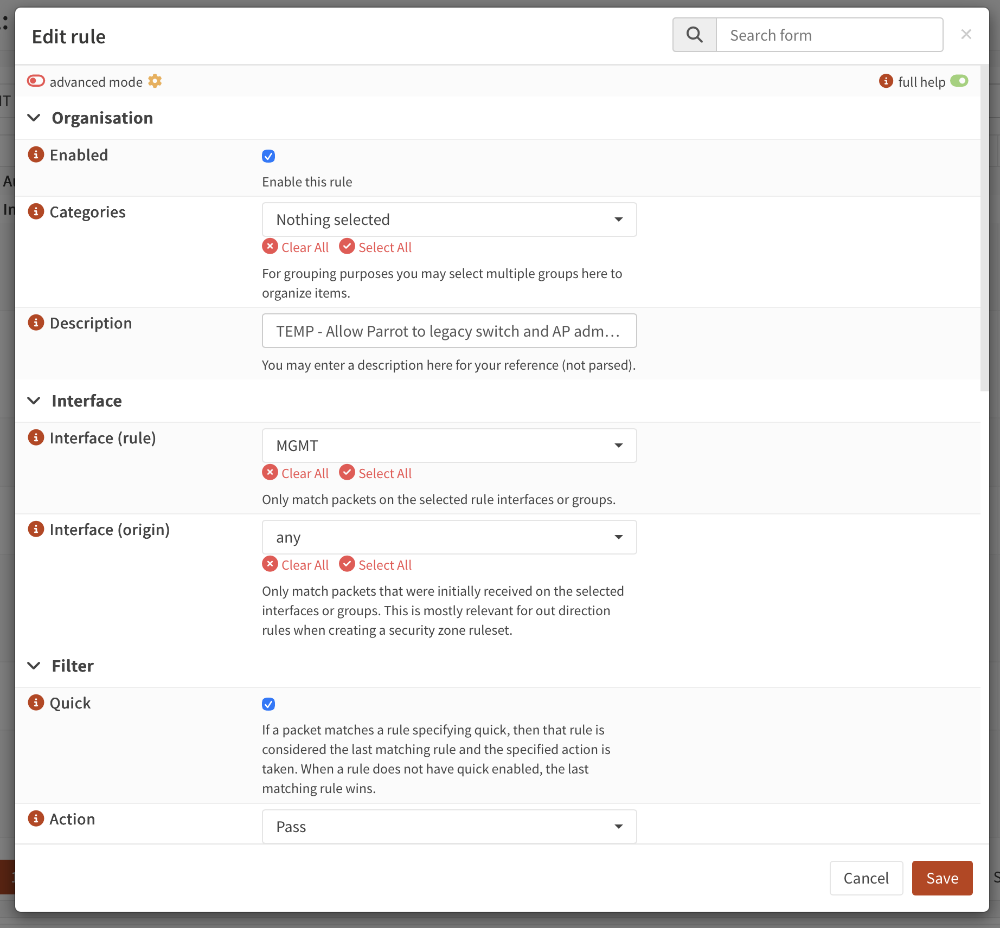

# Troubleshooting Record: Management VLAN Access to Legacy Omada Devices

| Field | Record |
|---|---|
| Project | Home Network and SOC Lab |
| Record date | September 23, 2026 |
| Incident date and troubleshooting duration | September 23, 2026; approximately 10 minutes, confirmed by the project owner |
| Household connectivity impact | None, confirmed by the project owner |
| Implementation checkpoint | Stage 3, Step 9: Management VLAN validation |
| Category | Network configuration and management access |
| Operational status | Resolved — access confirmed by the project owner |
| Documentation status | Nine reviewed redacted screenshot derivatives attached; switch address confirmed by the project owner |

## Summary

During Management VLAN validation, the Parrot OS administration device at `10.10.10.110` passed the other Step 9 checks but could not open the switch and AP management pages at their legacy addresses. OPNsense initially logged the attempted access against **“Block unapproved MGMT access to internal networks.”** A subsequent test produced a pass entry, but the management page still did not load.

The project owner identified an incorrect destination in the management-access firewall rule: it targeted the MGMT VLAN instead of the intended legacy destination. The corrected rule screenshot shows `ADMIN_HOSTS` as the source, `LEGACY_INFRA` as the destination, and `ADMIN_PORTS` as the destination-port alias. The AP screenshot shows **Layer-3 Accessibility enabled**. The owner confirmed successful access to both devices from the legacy network and from Management VLAN 10 after these corrections.

Troubleshooting took approximately **10 minutes**. **Household connectivity was not affected.** The impact was limited to the management-access problem under investigation.

The logs also distinguish two different connections: earlier HTTPS requests to the AP were blocked; later HTTPS packets passed on LAN egress while HTTP requests remained blocked on MGMT ingress. The AP configuration screenshot shows HTTPS port 443 and the HTTP server disabled. The HTTP block therefore should not be treated as evidence that the later HTTPS request was blocked.

This record documents a configuration troubleshooting event during implementation. It does not establish completion of the remaining VLAN migration or isolation tests.

## Environment and observed impact

OPNsense routes traffic between Management VLAN 10 and the existing legacy network. The Omada switch and AP retain their legacy management addresses at this checkpoint. Parrot OS is the administration device.

| Endpoint | Address | Evidence status |
|---|---|---|
| Parrot OS on Management VLAN 10 | `10.10.10.110` | Confirmed by the owner and visible as the source in E01/E02 |
| OPNsense Management VLAN gateway | `10.10.10.1` | Stage 3 configuration target; Step 9 firewall access reported working |
| OPNsense legacy LAN address | `10.255.250.1` | Last recorded in September 22 inventory; incident-time confirmation pending |
| Omada switch legacy management | `10.255.250.153` | Confirmed by the owner; consistent with E07 and the September 22 inventory |
| Omada AP legacy management | `10.255.250.181` | AP identity from September 22 inventory; incident traffic visible in E01/E02 and address included in E07 |

The observed failure was management-page access from Parrot on VLAN 10. The owner reported that every other Step 9 check passed, which covers expected addressing, DNS, internet access, and access to the OPNsense management page. The owner subsequently confirmed approximately 10 minutes of troubleshooting and no interruption to household connectivity.

At this incident checkpoint, the owner confirmed the switch address as `10.255.250.153`; the incident-time discrepancy was resolved. Later Management addresses are recorded under the Stage 3 follow-up below.

## Troubleshooting sequence and recorded times

| Time or stage | Observation | Basis |
|---|---|---|
| Initial Step 9 test | Parrot could not open the legacy switch and AP management pages; other checks passed | Owner report |
| September 23, approximately 13:31–13:33 | Repeated MGMT ingress TCP blocks from `10.10.10.110` to `10.255.250.181:443` | Visible log times in E01; seconds are truncated |
| September 23, approximately 13:41 | LAN egress TCP pass entries to `10.255.250.181:443`, alongside MGMT ingress blocks to `10.255.250.181:80` | Visible log times in E02 |
| Corrections, exact times not recorded | Owner corrected the MGMT destination to the legacy destination and enabled AP Layer-3 Accessibility | Owner report; resulting form values shown in E03/E04 |
| 13:57:53 screenshot filename | AP configuration form shows Layer-3 Accessibility enabled and HTTP server disabled | E03 filename and contents |
| 13:58:19 screenshot filename | Firewall edit form shows `LEGACY_INFRA` as the destination | E04 filename and contents |
| Final retest, exact time not recorded | Both devices accessible from the legacy network and VLAN 10 | Owner report |
| 14:13:27 screenshot filename | MGMT rule list shows the legacy TCP/UDP permit above the internal-network block, plus a similar TCP permit below it | E05 |
| 14:13:48–14:14:48 screenshot filenames | Alias definitions and upper rule fields captured for the incident record | E06–E09 |

The approximately 10-minute troubleshooting duration comes from the owner. Log timestamps and screenshot filename times describe different events and are not used to calculate that duration. Exact start and resolution times, precise change order, and the log timezone were not recorded. There was no household connectivity downtime.

## Cause and corrective changes

### Incorrect firewall-rule destination

The intended connection originated on Management VLAN 10 and targeted devices still addressed on the legacy network. An allow rule whose destination is the MGMT network does not match those legacy destination addresses. The initial block entry is consistent with the intended exception failing to match.

The confirmed correction was to replace the MGMT destination with `LEGACY_INFRA`. E04 verifies the selected alias name; E07 shows its two host addresses. The original incorrect destination is established by the owner's report rather than a before-change rule screenshot.

The following fields are directly visible in E04:

| Rule field | Captured value |
|---|---|
| Source | `ADMIN_HOSTS` |
| Invert Source | Unchecked |
| Source Port | `any` |
| Destination | `LEGACY_INFRA` |
| Invert Destination | Unchecked |
| Destination Port | `ADMIN_PORTS` |
| Log | Unchecked at capture time |
| State type | `keep state` |
| Gateway | `None`, as displayed |

The later upper edit form, E09, shows **Enabled checked**, **Interface (rule) MGMT**, **Interface (origin) any**, **Quick checked**, and **Action Pass**. E05 shows IPv4 and TCP/UDP for the upper legacy-access permit. E04/E09 are edit-form views; E05 additionally shows the configured rule list. Successful application is supported by the owner's retest. Persistence across a reboot was not part of this incident's recorded validation.

### Verified alias definitions

All three alias screenshots show Enabled checked.

| Alias | Type | Captured contents | Evidence |
|---|---|---|---|
| `ADMIN_HOSTS` | Host(s) | `10.10.10.110`, `10.10.20.110` | E06 |
| `LEGACY_INFRA` | Host(s) | `10.255.250.153`, `10.255.250.181` | E07 |
| `ADMIN_PORTS` | Port(s) | `22`, `443` | E08 |

The destination alias targets two individual hosts. `ADMIN_PORTS` contains SSH/HTTPS port numbers and excludes HTTP port 80. A port alias does not set transport protocol: the rule list's upper legacy permit is **TCP/UDP**, so its displayed scope includes both protocols for those numbers. This records the configured policy; it does not establish that SSH or any UDP service is listening or was tested. The extra Trusted address in `ADMIN_HOSTS` does not demonstrate that Parrot has migrated to that subnet.

### Rule order and additional observation

E05 shows these interface rules in the MGMT view, in this order. Automatically generated rules are collapsed above them.

| Position among visible interface rules | Action | IPv4 protocol | Source | Destination | Destination ports |
|---:|---|---|---|---|---|
| 1 | Pass | TCP | `ADMIN_HOSTS` | This Firewall | HTTPS / 443 |
| 2 | Pass | TCP/UDP | `ADMIN_HOSTS` | `LEGACY_INFRA` | `ADMIN_PORTS` / 22, 443 |
| 3 | Pass | TCP/UDP | MGMT network | This Firewall | Domain / 53 |
| 4 | Block | Any | MGMT network | This Firewall | Any |
| 5 | Block | Any | MGMT network | `LOCAL_V4_NETS` | Any |
| 6 | Pass | Any | MGMT network | Any | Any |
| 7 | Pass | TCP | `ADMIN_HOSTS` | `LEGACY_INFRA` | `ADMIN_PORTS` / 22, 443 |

The legacy permit at position 2 is above the internal-network block at position 5. A similar TCP-only permit remains at position 7 with the same description: **“TEMP - Allow Parrot to legacy switch and AP admin ports.”** The upper TCP/UDP rule already covers the intended TCP traffic. The lower copy is therefore redundant for that traffic; a connection denied by an earlier matching quick block cannot be rescued by this later permit.

This additional rule-order finding is a follow-up observation from E05, separate from the owner's identified destination error. At incident close, removing the redundant lower rule and reviewing whether the upper permit needed UDP were cleanup recommendations that had not yet been performed or included in the reported resolution. The later cleanup capture C02 shows both temporary legacy permits removed, as recorded in the later Stage 3 context below.

OPNsense normally evaluates quick rules on a first-match basis and applies inbound policy on the interface where traffic originates. The source interface and destination network are separate rule fields. [OPNsense firewall documentation](https://docs.opnsense.org/manual/firewall.html)

### AP management access across subnets

The owner also enabled **Management → Web Server → Layer-3 Accessibility** on the AP. E03 shows that option checked. Omada documents that this setting permits its management page to be accessed from a different subnet. [Omada standalone AP management documentation](https://support.omadanetworks.com/us/document/13128/)

| AP web-server field | Captured value in E03 |
|---|---|
| Secure Server Port | `443` |
| Server Port | `80` displayed; HTTP Server checkbox is unchecked |
| Layer-3 Accessibility | Enabled |
| HTTP Server | Disabled |
| TLS Version 1.0/1.1 | Disabled |
| Older Security Kits | Disabled |
| Session Timeout | 15 minutes |

At the captured configuration, the appropriate AP management URL is `https://10.255.250.181`. The displayed Server Port value of 80 does not mean the HTTP service is enabled.

This setting applies specifically to the AP. It does not explain the switch's behavior. Both corrections were in place when successful access was reported; separate tests demonstrating the effect of each correction in isolation were not recorded.

| Configuration item | Before | Confirmed correction |
|---|---|---|
| Management-access rule destination | MGMT VLAN/network, per owner | `LEGACY_INFRA`, visible in E04 |
| AP Layer-3 Accessibility | Not enabled, per reported corrective action | Enabled |
| Access from Parrot on VLAN 10 | Management pages unavailable | Both legacy management addresses accessible |

No DHCP, VLAN membership, gateway, NAT, firmware, or device-address change is recorded as part of the confirmed resolution.

### Interpreting the intermediate pass entries

E02 contains green **LAN / Out / pass** rows for TCP traffic from `10.10.10.110` to `10.255.250.181:443`. Their displayed label is **“let out anything from firewall host itself.”** These entries record an outbound firewall decision; they do not identify which inbound MGMT exception admitted the connection or demonstrate a completed TCP handshake, web response, or login.

In the same capture, the red **MGMT / In / block** rows target port **80**, not 443. The two colors represent different flows. E08 subsequently confirms that port 80 is absent from `ADMIN_PORTS`, and E03 shows the AP HTTP server disabled. Those later settings are consistent with HTTPS management being the intended path; their exact values at the earlier log time are not independently established. An HTTP permit is not needed merely to eliminate those red entries.

## Validation results

| Source | Target/check | Reported result |
|---|---|---|
| Parrot, `10.10.10.110`, VLAN 10 | Legacy switch management page | Passed after corrections |
| Parrot, `10.10.10.110`, VLAN 10 | Legacy AP management page | Passed after corrections |
| Legacy network | Legacy switch management page | Passed after corrections |
| Legacy network | Legacy AP management page | Passed after corrections |
| Parrot on VLAN 10 | Remaining Step 9 connectivity checks | Reported passed before resolution |
| Household devices | Internet/Wi-Fi connectivity during troubleshooting | Unaffected, confirmed by the owner |

These recovery results are confirmed by the project owner. E01/E02 independently support the failed HTTPS requests and the later outbound HTTPS pass entries. E03 shows the AP administration interface, but does not show the client address or network used to open it. The supplied images do not independently demonstrate all four successful source/target tests. E05–E09 establish the displayed rule settings, order, and aliases. The switch's actual service listeners, explicit login-test results, and persistence after reboot remain unrecorded. Access from unauthorized VLANs was not tested as part of this incident record.

## Later Stage 3 context

The [Stage 3 completion record](../../00_Project_Overview/04_Stage_3_Completion_2026-09-23.md) documents later Parrot-supplied screenshots showing the switch at `10.10.10.2` and the AP at `10.10.10.3` on the Management VLAN. The first later set (P02, 23:02) still showed overlapping temporary `LEGACY_INFRA` rules. The subsequent cleanup capture C02 (23:43) shows both legacy permits and the temporary MGMT firewall-HTTPS permit removed. C03 shows `ADMIN_HOSTS` narrowed to `10.10.20.110`. These cleanup changes close the visible temporary-rule observation; this incident gallery preserves the earlier settings for chronology. The project owner confirmed current management access; this documentation review did not connect to or retest the live network. These later observations provide historical follow-up and do not change the incident-time addresses, sequence, or conclusions above.

## Screenshot evidence

All nine source screenshots were inspected. The images embedded below are reviewed redacted derivatives rather than byte-for-byte originals. Solid masks remove the administrator account/hostname and unrelated browser or desktop chrome where visible; private technical IP addresses, firewall aliases, and relevant configuration fields remain visible. Programmatic comparison verified that pixels outside the declared mask rectangles match the source captures. The unredacted originals remain private, and the filenames below preserve their original capture references.

| Evidence | Original filename | What it establishes |
|---|---|---|
| E01 — Initial HTTPS blocks | `Screenshot 2026-09-23 at 13.45.20.png` | MGMT ingress blocks from `10.10.10.110` to AP address `10.255.250.181:443` |
| E02 — HTTPS passes and HTTP blocks | `Screenshot 2026-09-23 at 13.45.32.png` | LAN egress passes to AP port 443 and separate MGMT ingress blocks to AP port 80 |
| E03 — AP web-server configuration | `Screenshot 2026-09-23 at 13.57.53.png` | Layer-3 Accessibility enabled; secure port 443; HTTP Server disabled |
| E04 — Corrected rule fields | `Screenshot 2026-09-23 at 13.58.19.png` | `ADMIN_HOSTS` → `LEGACY_INFRA`, source port any, destination alias `ADMIN_PORTS` |
| E05 — MGMT rule order | `Screenshot 2026-09-23 at 14.13.27.png` | Upper TCP/UDP legacy permit precedes internal-network block; similar TCP permit remains below |
| E06 — Administration hosts | `Screenshot 2026-09-23 at 14.13.48.png` | Enabled Host(s) alias containing `10.10.10.110` and `10.10.20.110` |
| E07 — Legacy destinations | `Screenshot 2026-09-23 at 14.14.15.png` | Enabled Host(s) alias containing `10.255.250.153` and `10.255.250.181` |
| E08 — Administration ports | `Screenshot 2026-09-23 at 14.14.28.png` | Enabled Port(s) alias containing 22 and 443 |
| E09 — Upper rule fields | `Screenshot 2026-09-23 at 14.14.48.png` | Enabled, MGMT rule interface, origin any, Quick checked, Action Pass |

### E01 — Initial HTTPS blocks

The visible entries use TCP source ports such as 58274 and 58278 and destination port 443. Their label matches the originally reported internal-network block.

### E02 — HTTPS passes and separate HTTP blocks

The pass rows use source ports 44908 and 44906 with destination 443. The block rows use source ports such as 34264 and 34256 with destination 80. Source address, destination port, interface, and direction must be compared before treating these as the same connection.

### E03 — AP Layer-3 Accessibility

The AP configuration form shows Layer-3 Accessibility checked and HTTP Server unchecked. The browser address and client network are outside the image.

### E04 — Corrected firewall destination

The rule edit form shows `LEGACY_INFRA` as Destination. This verifies the corrected selection shown to the user; the screenshot does not include the top of the rule or the surrounding rule order.

### E05 — MGMT rule order

The intended legacy-access permit is second among the visible interface rules. A TCP-only copy with the same description appears below the internal-network block and internet permit.

### E06 — ADMIN_HOSTS

The enabled host alias contains the current MGMT administration address and the planned Trusted administration address.

### E07 — LEGACY_INFRA

The alias contains the owner-confirmed switch address `10.255.250.153` and the AP address `10.255.250.181`.

### E08 — ADMIN_PORTS

The enabled port alias includes 22 and 443. Port 80 is absent.

### E09 — Upper firewall rule fields

The form confirms Enabled, MGMT as Interface (rule), any as Interface (origin), Quick enabled, and Action Pass. Because both legacy-access rules share a description, this image alone does not uniquely identify which copy is being edited; E05 distinguishes their displayed order and protocols.

These embedded files are the reviewed redacted derivatives. Private technical IP addresses and aliases are retained because they support the incident analysis; the administrator account/hostname and unrelated chrome are masked where visible. The unredacted source captures and raw configuration exports remain outside this report.

## Lessons and follow-up

- Compare the actual source address, destination address, protocol, and destination port with every field in an allow rule. A correct interface selection does not compensate for an incorrect destination.
- A firewall pass entry establishes that the logged packet was permitted. It does not establish a completed connection, successful web response, or login.
- Distinguish HTTPS on TCP 443 from HTTP on TCP 80 when interpreting adjacent pass and block entries. A configured port number does not establish that its service is enabled.
- Check each device's own restrictions on management from another subnet when building routed administration access.
- Preserve the four successful source/target tests above as the incident's recovery evidence. Record isolation tests separately before declaring segmentation validated.
- Capture both rule fields and alias definitions, since the latter establish the actual hosts and port numbers covered by a rule. E06–E08 now provide those definitions.
- The later C02 cleanup image shows both temporary legacy permits removed. Preserve this incident-time rule-order lesson while using the Stage 3 completion record for the current policy.
- Record persistence, post-cleanup validation, and refreshed backups for the final policy. Initial Stage 3 backups were owner-confirmed; a refreshed backup after the later cleanup has not been separately reported.

## Record limits

Exact start/end timestamps and the log timezone are not recorded; the owner-provided estimate of approximately 10 minutes is sufficient for the troubleshooting-duration field. Successful-access screenshots identifying the source network would strengthen the owner-confirmed recovery results, but are optional. There is no need to recreate the fault for additional evidence.

The addressing baseline comes from the project's [Implementation Progress: Core Network and Pre-VLAN Preparation](../../00_Project_Overview/03_Implementation_Progress_2026-09-22.md), dated September 22, 2026. Incident findings distinguish the project owner's reports from directly visible details in E01–E09.
